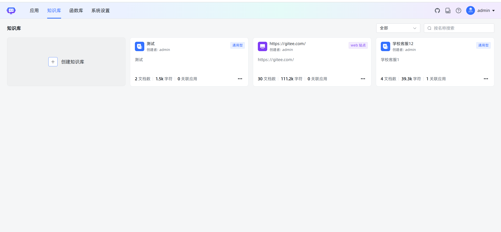
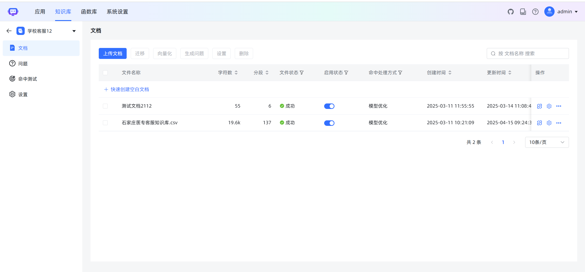
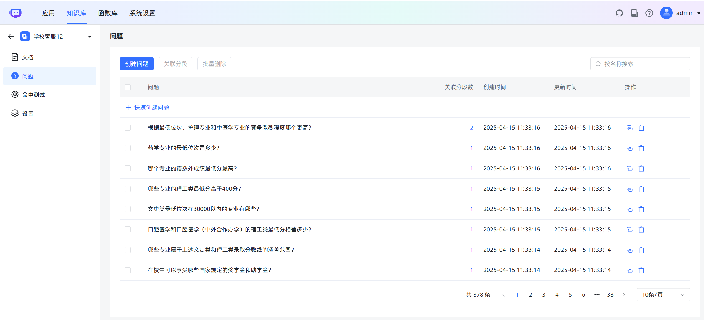
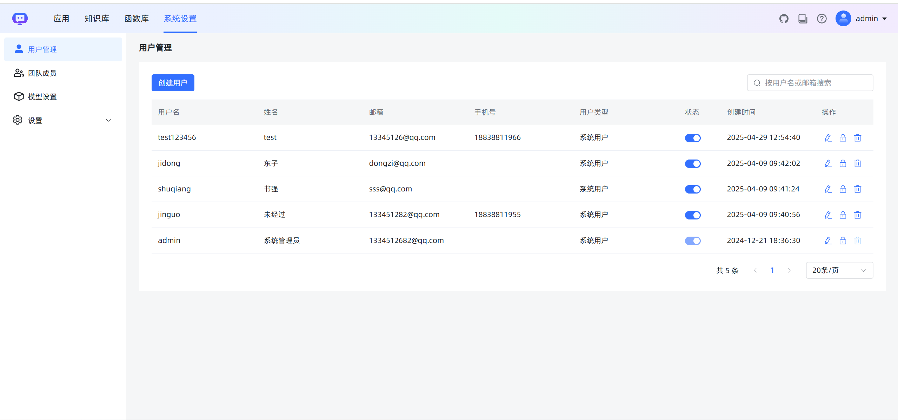

<p align="center"></p>
<h3 align="center">Ready-to-use, flexible RAG Chatbot</h3>
<h3 align="center">基于大模型和 RAG 的开源知识库问答系统</h3>
<p align="center"><a href="https://trendshift.io/repositories/9113" target="_blank"></a></p>
<p align="center">
  <a href="https://www.gnu.org/licenses/gpl-3.0.html#license-text"></a>
  <a href="https://github.com/1Panel-dev/maxkb/releases/latest"></a>
  <a href="https://github.com/1Panel-dev/maxkb"></a>    
  <a href="https://hub.docker.com/r/1panel/maxkb"></a><br/>
 [<a href="/README_CN.md">中文(简体)</a>] | [<a href="/README.md">English</a>] 
</p>
<hr/>

MaxKB4J = Max Knowledge Base for Java, it is a chatbot based on Large Language Models (LLM) and Retrieval-Augmented Generation (RAG). MaxKB is widely applied in scenarios such as intelligent customer service, corporate internal knowledge bases, academic research, and education.

- **Ready-to-Use**: Supports direct uploading of documents / automatic crawling of online documents, with features for automatic text splitting, vectorization, and RAG (Retrieval-Augmented Generation). This effectively reduces hallucinations in large models, providing a superior smart Q&A interaction experience.
- **Flexible Orchestration**: Equipped with a powerful workflow engine and function library, enabling the orchestration of AI processes to meet the needs of complex business scenarios.
- **Seamless Integration**: Facilitates zero-coding rapid integration into third-party business systems, quickly equipping existing systems with intelligent Q&A capabilities to enhance user satisfaction.
- **Model-Agnostic**: Supports various large models, including private models (such as DeepSeek, Llama, Qwen, etc.) and public models (like OpenAI, Claude, Gemini, etc.).

## Quick start

Execute the script below to start a MaxKB4J container using Docker:

```bash
docker run -d --name=maxkb4j --restart=always -p 8080:8080 -v ~/.maxkb:/var/lib/postgresql/data -v ~/.python-packages:/opt/maxkb/app/sandbox/python-packages tarzan/maxkb
```

Access MaxKB web interface at `http://your_server_ip:8080` with default admin credentials:

- username: admin
- password: MaxKB4j@123..

中国用户如遇到 Docker 镜像 Pull 失败问题，请参照该 [离线安装文档](https://maxkb.cn/docs/installation/offline_installtion/) 进行安装。

## Problem consultation


👉Claim the coupon：https://t.zsxq.com/YdmRl

## Screenshots


<table style="border-collapse: collapse; border: 1px solid black;">
  <tr>
    <td style="padding: 5px;background-color:#fff;"></td>
    <td style="padding: 5px;background-color:#fff;"></td>
  </tr>
  <tr>
    <td style="padding: 5px;background-color:#fff;"></td>
    <td style="padding: 5px;background-color:#fff;"></td>
  </tr>
 <tr>
    <td style="padding: 5px;background-color:#fff;"></td>
    <td style="padding: 5px;background-color:#fff;"></td>
  </tr>
 <tr>
    <td style="padding: 5px;background-color:#fff;"></td>
    <td style="padding: 5px;background-color:#fff;"></td>
  </tr>
 <tr>
    <td style="padding: 5px;background-color:#fff;"></td>
    <td style="padding: 5px;background-color:#fff;"></td>
  </tr>
 <tr>
    <td style="padding: 5px;background-color:#fff;"></td>
    <td style="padding: 5px;background-color:#fff;"></td>
  </tr>
 <tr>
    <td style="padding: 5px;background-color:#fff;"></td>
    <td style="padding: 5px;background-color:#fff;"></td>
  </tr>
 <tr>
    <td style="padding: 5px;background-color:#fff;"></td>
    <td style="padding: 5px;background-color:#fff;"></td>
  </tr>
</table>

## Technical stack

- Frontend：[Vue.js](https://vuejs.org/)
- Backend：[Java17 / Springboot3](https://www.djangoproject.com/)
- LLM Framework：[LangChain4j](https://docs.langchain4j.dev/)
- Database：[PostgreSQL + pgvector](https://www.postgresql.org/)
- Full-text retrieval database：[MongoDB](https://www.mongodb.com/)
- User authentication：[sa-token](https://sa-token.dev33.cn/)

## Star History

[](https://star-history.com/#1Panel-dev/MaxKB&Date)

## License

Licensed under The GNU General Public License version 3 (GPLv3)  (the "License"); you may not use this file except in compliance with the License. You may obtain a copy of the License at

<https://www.gnu.org/licenses/gpl-3.0.html>

Unless required by applicable law or agreed to in writing, software distributed under the License is distributed on an "AS IS" BASIS, WITHOUT WARRANTIES OR CONDITIONS OF ANY KIND, either express or implied. See the License for the specific language governing permissions and limitations under the License.
