<h3 align="center">基于大模型和 RAG 的知识库问答系统</h3>
<h4 align="center">开箱即用、灵活的RAG知识库加工作流聊天机器人</h4>


MaxKB4j = Max Knowledge Base for Java，是一款基于Java语言开发的LLM工作流应用和 RAG 的开源LLMOps平台，项目主要借鉴了MaxKB和FastGPT,并将两个的优势结合到一个项目上，使用高性能、高稳定性以及安全可靠的JAVA语言重新设计开发。MaxKB4j广泛应用于智能客服、企业内部知识库、学术研究与教育等场景。

- **开箱即用**：支持直接上传文档 / 自动爬取在线文档，支持文本自动拆分、向量化和 RAG（检索增强生成），有效减少大模型幻觉，智能问答交互体验好；
- **模型中立**：支持对接各种大模型，包括本地私有大模型（DeekSeek R1 / Llama 3 / Qwen 2 等）、国内公共大模型（通义千问 / 腾讯混元 / 字节豆包 / 百度千帆 / 智谱 AI / Kimi 等）和国外公共大模型（OpenAI / Claude / Gemini 等）；
- **灵活编排**：内置强大的工作流引擎和函数库，支持编排 AI 工作过程，满足复杂业务场景下的需求；
- **无缝嵌入**：支持零编码快速嵌入到第三方业务系统，让已有系统快速拥有智能问答能力，提高用户满意度。
- **支持接入MCP Server**：MCP（Model Context Protocol，模型上下文协议）是一个用于 AI 与开发环境交互的标准协议，让 AI 具备代码上下文的感知能力，而不只是单纯地做代码补全或聊天问答。


目前已经完成所有核心的功能的开发，正在完善优化项目

我的技术博客：https://tarzan.blog.csdn.net/

## 功能导图
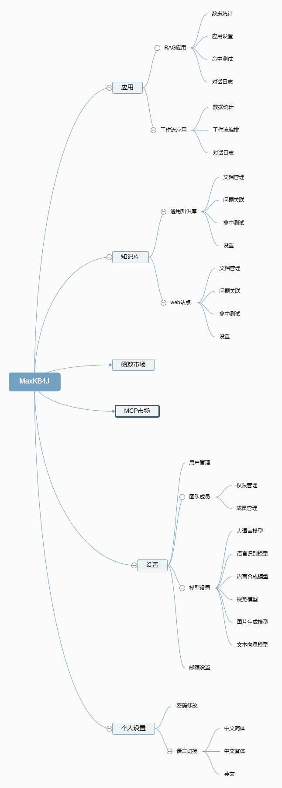

## 快速开始

```
java -jar maxkb4j-1.0.0.jar
```

## 问题咨询


👉领取优惠券：https://t.zsxq.com/YdmRl

## 问题反馈
     有问题提交issues,或者通过我的博客留言！ 

## 案例展示

MaxKB4j 自发布以来，日均安装下载超过 1000 次，被广泛应用于智能客服、企业内部知识库、学术教育研究等场景。

todo

## UI 展示


<table style="border-collapse: collapse; border: 1px solid black;">
  <tr>
    <td style="padding: 5px;background-color:#fff;">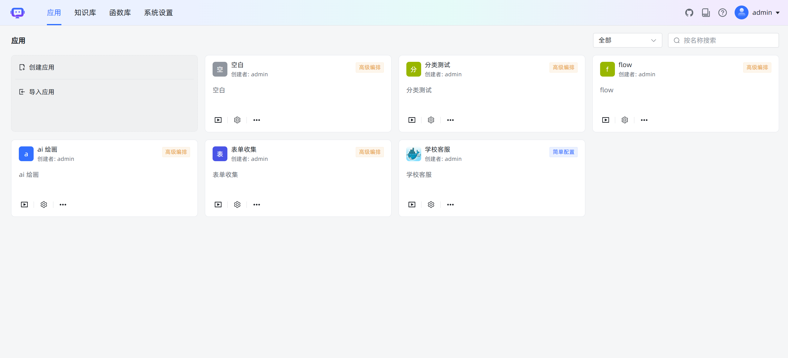</td>
    <td style="padding: 5px;background-color:#fff;">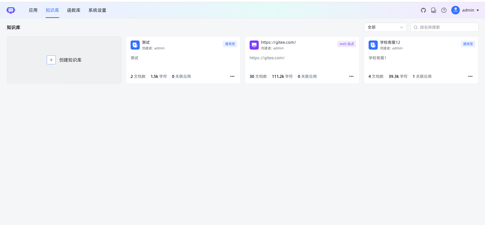</td>
  </tr>
  <tr>
    <td style="padding: 5px;background-color:#fff;">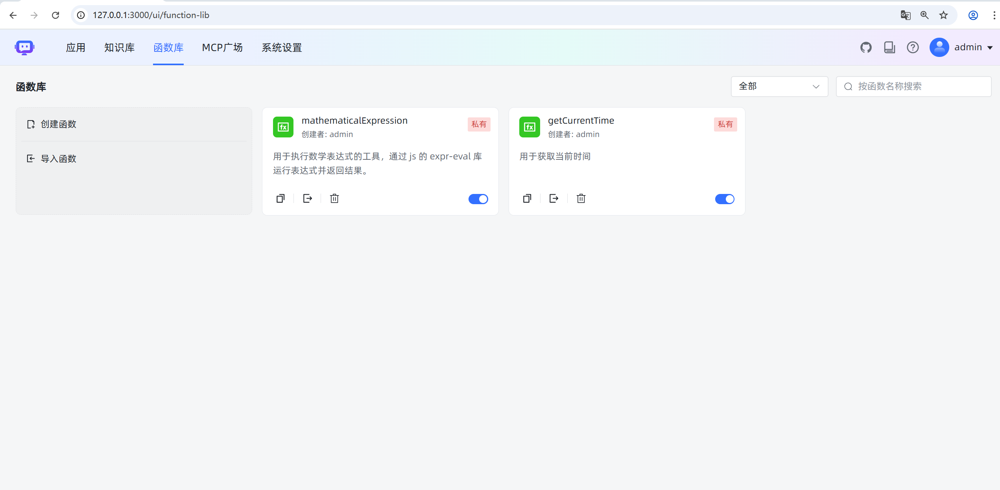</td>
    <td style="padding: 5px;background-color:#fff;">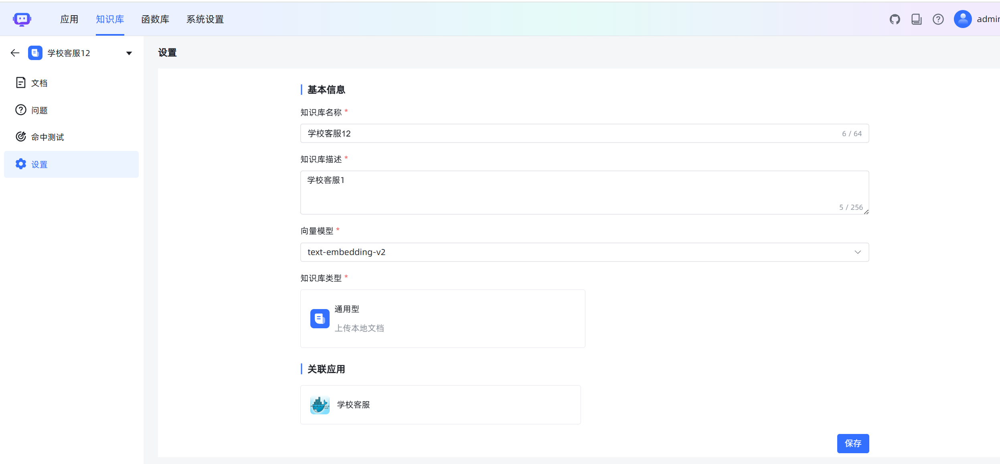</td>
  </tr>
 <tr>
    <td style="padding: 5px;background-color:#fff;">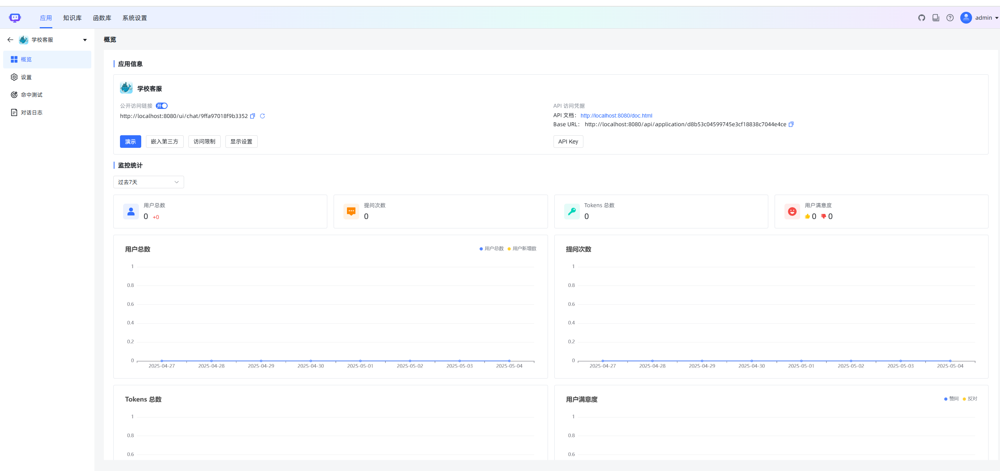</td>
    <td style="padding: 5px;background-color:#fff;">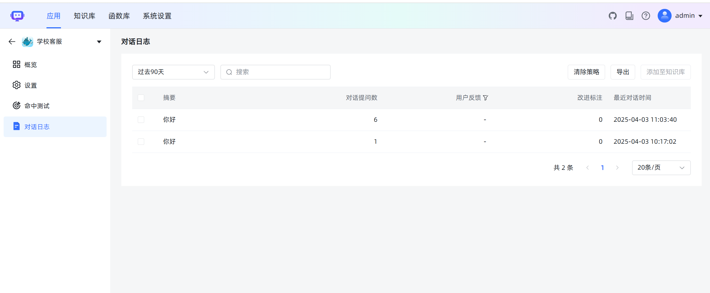</td>
  </tr>
 <tr>
    <td style="padding: 5px;background-color:#fff;">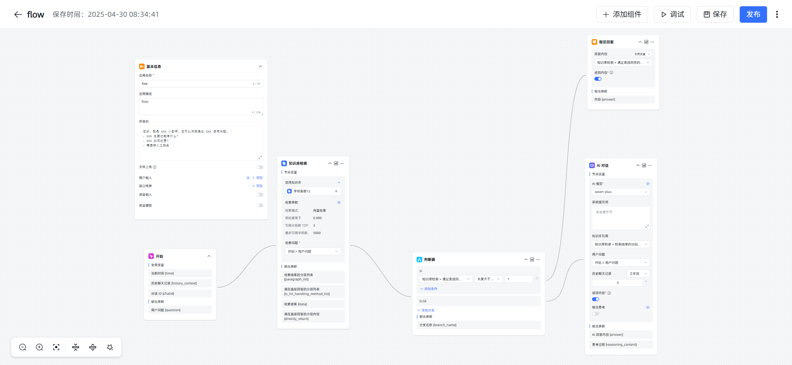</td>
    <td style="padding: 5px;background-color:#fff;">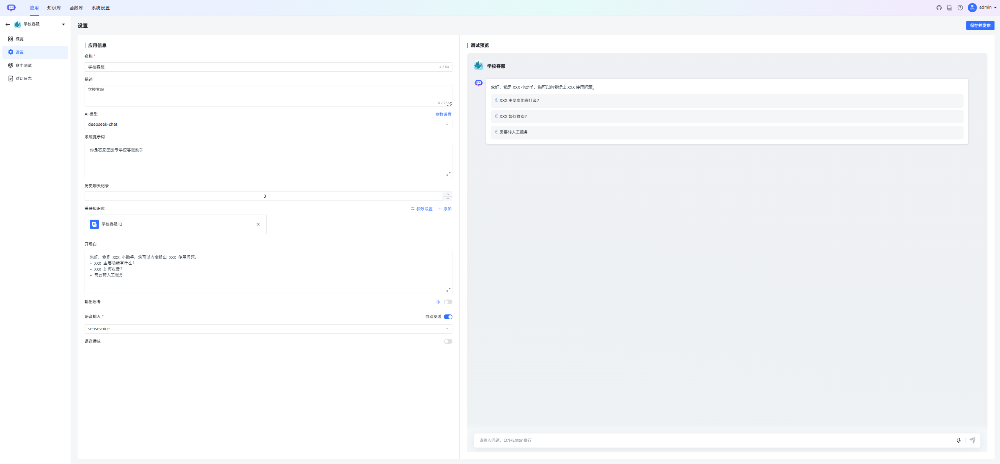</td>
  </tr>
 <tr>
    <td style="padding: 5px;background-color:#fff;">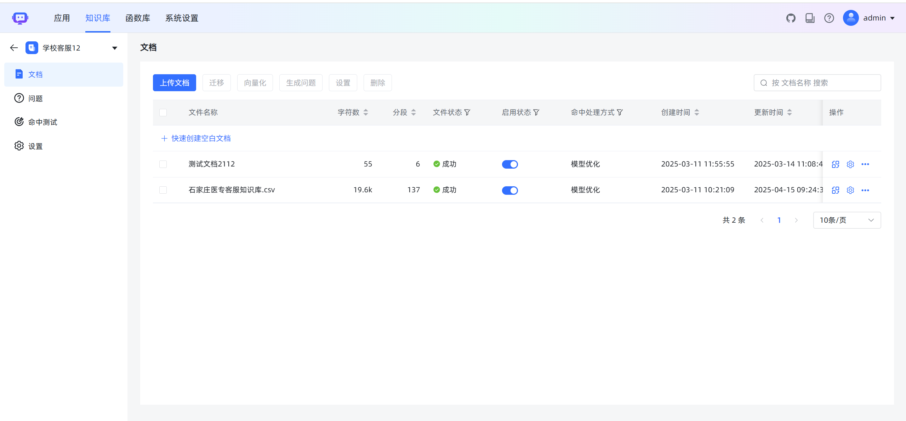</td>
    <td style="padding: 5px;background-color:#fff;"></td>
  </tr>
 <tr>
    <td style="padding: 5px;background-color:#fff;"></td>
    <td style="padding: 5px;background-color:#fff;">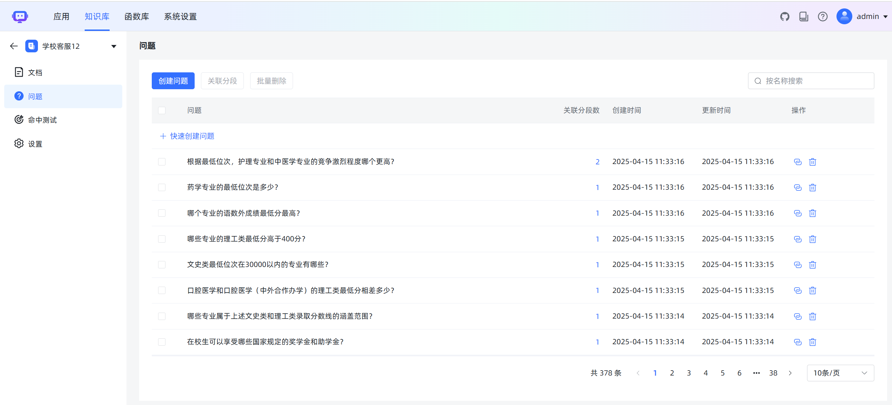</td>
  </tr>
 <tr>
    <td style="padding: 5px;background-color:#fff;">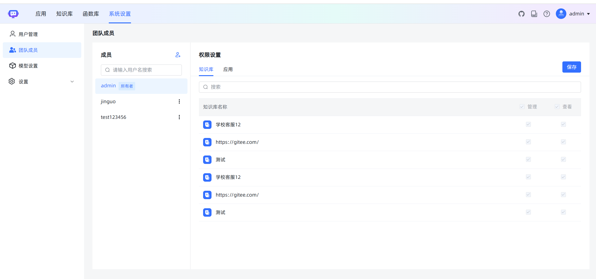</td>
    <td style="padding: 5px;background-color:#fff;">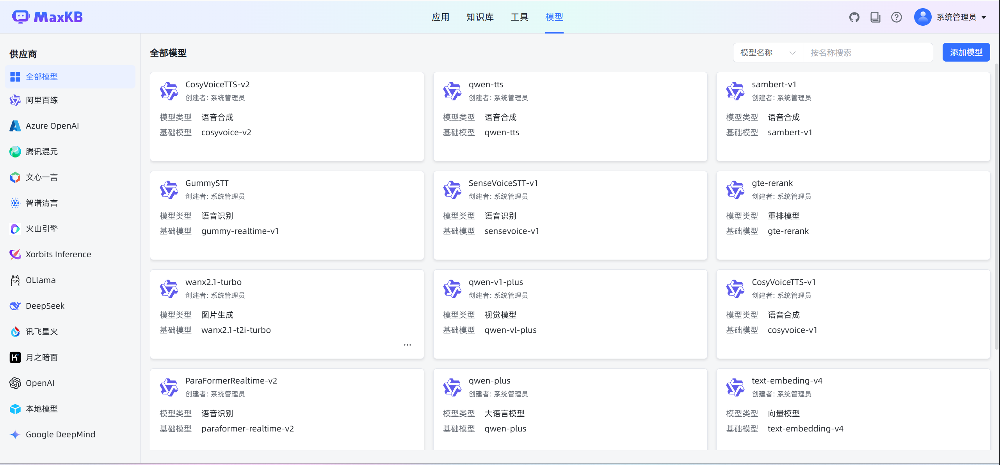</td>
  </tr>
 <tr>
    <td style="padding: 5px;background-color:#fff;">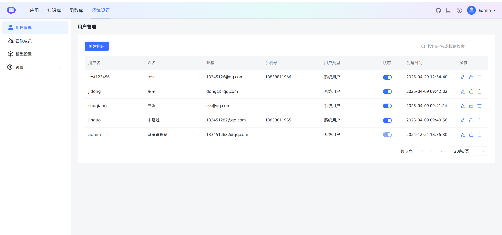</td>
    <td style="padding: 5px;background-color:#fff;">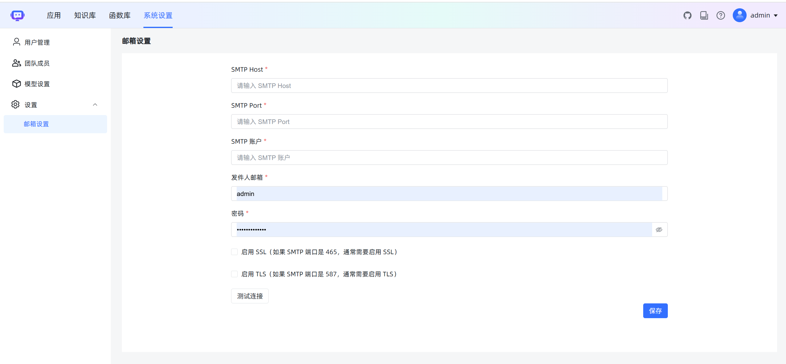</td>
  </tr>
</table>

## 技术栈

- 前端：[Vue.js](https://cn.vuejs.org/)
- 后端：[Java17 / Springboot3](https://www.djangoproject.com/)
- 缓存：[caffeine](https://github.com/ben-manes/caffeine)
- LangChain4j：[LangChain4j](https://docs.langchain4j.dev/)
- 向量数据库：[PostgreSQL / pgvector](https://www.postgresql.org/)
- 全文检索数据库：[MongoDB](https://www.mongodb.com/)
- 用户鉴权：[sa-token](https://sa-token.dev33.cn/)

## 我的技术专栏

- [《看看这个！👉 点击AI大模型应用开发！🔥》](https://blog.csdn.net/weixin_40986713/category_12606825.html)

- **《AI语音合成与识别》**》：[https://blog.csdn.net/weixin_40986713/category_12735457.html](https://blog.csdn.net/weixin_40986713/category_12735457.html)

- **《AI绘画 | Stable diffusion》**：[https://blog.csdn.net/weixin_40986713/category_12481790.html](https://blog.csdn.net/weixin_40986713/category_12481790.html)


## License

Copyright (c) 2025-2035 洛阳泰山 TARZAN, All rights reserved.

Licensed under The Apache License Version 2.0  (the "License"); you may not use this file except in compliance with the License. You may obtain a copy of the License at

<http://www.apache.org/licenses>

Unless required by applicable law or agreed to in writing, software distributed under the License is distributed on an "AS IS" BASIS, WITHOUT WARRANTIES OR CONDITIONS OF ANY KIND, either express or implied. See the License for the specific language governing permissions and limitations under the License.
