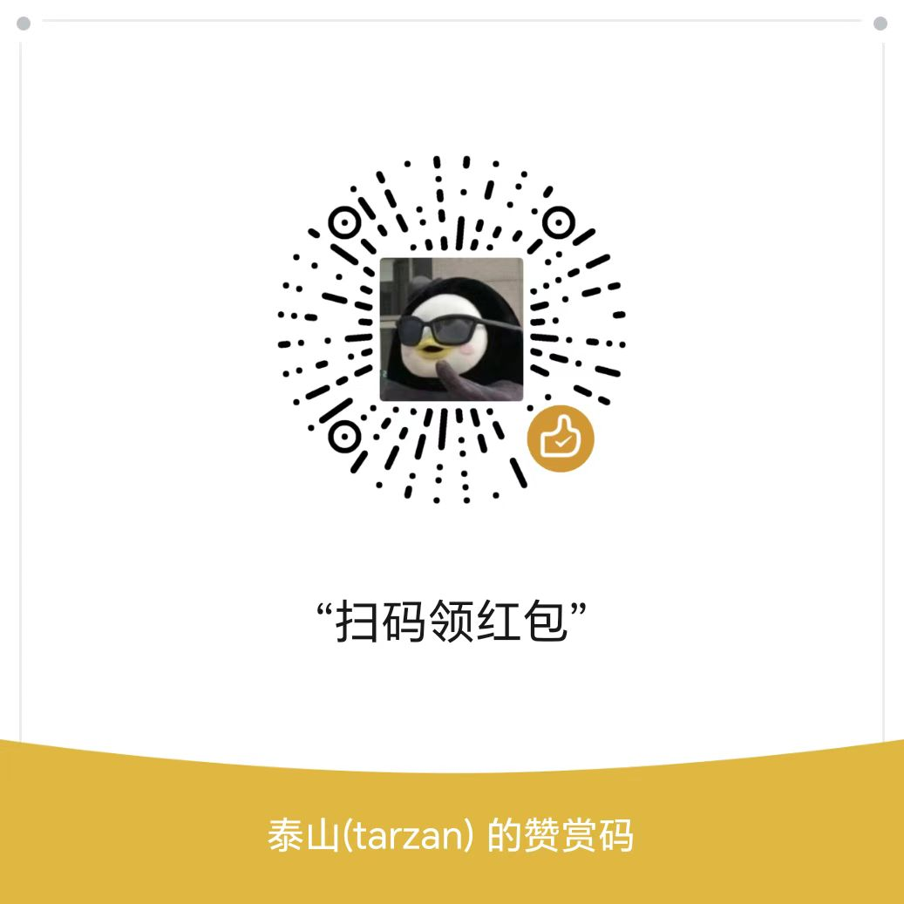

<h3 align="center">基于大模型和 RAG 的知识库问答系统</h3>
<h4 align="center">开箱即用、灵活的RAG知识库加工作流聊天机器人</h4>


MaxKB4j = Max Knowledge Base for Java，是一款基于Java语言开发的LLM工作流应用和 RAG 的开源LLMOps平台，项目主要借鉴了MaxKB和FastGPT,并将两个的优势结合到一个项目上，使用高性能、高稳定性以及安全可靠的JAVA语言重新设计开发。MaxKB4j广泛应用于 **智能客服、企业内部知识库、数据分析、学术研究与教育等场景** 。

- **开箱即用**：支持直接上传文档 / 自动爬取在线文档，支持文本自动拆分、向量化和 RAG（检索增强生成），有效减少大模型幻觉，智能问答交互体验好；
- **模型中立**：支持对接各种大模型，包括本地私有大模型（DeekSeek R1 / Llama 3 / Qwen 2 等）、国内公共大模型（通义千问 / 腾讯混元 / 字节豆包 / 百度千帆 / 智谱 AI / Kimi 等）和国外公共大模型（OpenAI / Claude / Gemini 等）；
- **灵活编排**：内置强大的工作流引擎和函数库，支持编排 AI 工作过程，满足复杂业务场景下的需求；
- **无缝嵌入**：支持零编码快速嵌入到第三方业务系统，让已有系统快速拥有智能问答能力，提高用户满意度。
- **支持接入MCP Server**：MCP（Model Context Protocol，模型上下文协议）是一个用于 AI 与开发环境交互的标准协议，让 AI 具备代码上下文的感知能力，而不只是单纯地做代码补全或聊天问答。
- **多种模型支持**：支持语音识别和语音合成模型、支持图像识别和图像生成模型。（视频生成模型支持规划中。。。）


目前已经完成所有核心的功能的开发，正在完善优化项目，预计月底完成，之后会完善文档和示例，欢迎大家参与完善。
- dev 分支目前基于maxkb v2分支代码改造，工作量比较大，目前请使用v1分支的代码


## 功能导图


## 快速开始

```
java -jar maxkb4j-1.0.0.jar
```
- 访问地址 - 访问地址 http://localhost:8080/login
- 默认用户/密码 admin/maxkb4j.


## 案例展示

MaxKB4j 自发布以来，日均安装下载超过 1000 次，被广泛应用于智能客服、企业内部知识库、学术教育研究等场景。

todo

## UI 展示


<table style="border-collapse: collapse; border: 1px solid black;">
  <tr>
    <td style="padding: 5px;background-color:#fff;"></td>
    <td style="padding: 5px;background-color:#fff;"></td>
  </tr>
  <tr>
    <td style="padding: 5px;background-color:#fff;"></td>
    <td style="padding: 5px;background-color:#fff;"></td>
  </tr>
 <tr>
    <td style="padding: 5px;background-color:#fff;"></td>
    <td style="padding: 5px;background-color:#fff;"></td>
  </tr>
 <tr>
    <td style="padding: 5px;background-color:#fff;"></td>
    <td style="padding: 5px;background-color:#fff;"></td>
  </tr>
 <tr>
    <td style="padding: 5px;background-color:#fff;"></td>
    <td style="padding: 5px;background-color:#fff;"></td>
  </tr>
 <tr>
    <td style="padding: 5px;background-color:#fff;"></td>
    <td style="padding: 5px;background-color:#fff;"></td>
  </tr>
 <tr>
    <td style="padding: 5px;background-color:#fff;"></td>
    <td style="padding: 5px;background-color:#fff;"></td>
  </tr>
 <tr>
    <td style="padding: 5px;background-color:#fff;"></td>
    <td style="padding: 5px;background-color:#fff;"></td>
  </tr>
</table>

## 技术栈

- 前端：[Vue.js](https://cn.vuejs.org/)
- 后端：[Java17 / Springboot3](https://www.djangoproject.com/)
- 缓存：[caffeine](https://github.com/ben-manes/caffeine)
- LangChain4j：[LangChain4j](https://docs.langchain4j.dev/)
- 向量数据库：[PostgreSQL / pgvector](https://www.postgresql.org/)
- 全文检索数据库：[MongoDB](https://www.mongodb.com/)
- 用户鉴权：[sa-token](https://sa-token.dev33.cn/)

## 我的技术专栏

- [《看看这个！👉 点击AI大模型应用开发！🔥》](https://blog.csdn.net/weixin_40986713/category_12606825.html)

- **《AI语音合成与识别》**》：[https://blog.csdn.net/weixin_40986713/category_12735457.html](https://blog.csdn.net/weixin_40986713/category_12735457.html)

- **《AI绘画 | Stable diffusion》**：[https://blog.csdn.net/weixin_40986713/category_12481790.html](https://blog.csdn.net/weixin_40986713/category_12481790.html)

## 问题和建议

请提交 issues [https://gitee.com/taisan/MaxKB4j/issues](https://gitee.com/taisan/MaxKB4j/issues)

## 咨询和反馈
- **这个项目我已独自坚持了半年多，期间尝试找合伙人未果——毕竟没人能长期免费投入。<br>我之前的开源项目，也因缺乏反馈和收益而被迫放弃。<br>如果你觉得这个项目有价值，请给个 Star 支持，或加入知识星球深度参与。<br>
你的支持，不只是鼓励，更是它能否持续发展的关键。<br>若长期无人支持，可能只能无奈停更。<br>一个 Star，一次加入，都能让它走得更远。**
- **提供MaxKB相关问题的咨询解答，协助部署等。**


<div>
  
  
</div>

## License

Copyright (c) 2025-2035 洛阳泰山 TARZAN, All rights reserved.

Licensed under The GNU General Public License version 3 (GPLv3)  (the "License");  you may not use this file except in compliance with the License. You may obtain a copy of the License at

<http://www.apache.org/licenses>

Unless required by applicable law or agreed to in writing, software distributed under the License is distributed on an "AS IS" BASIS, WITHOUT WARRANTIES OR CONDITIONS OF ANY KIND, either express or implied. See the License for the specific language governing permissions and limitations under the License.
