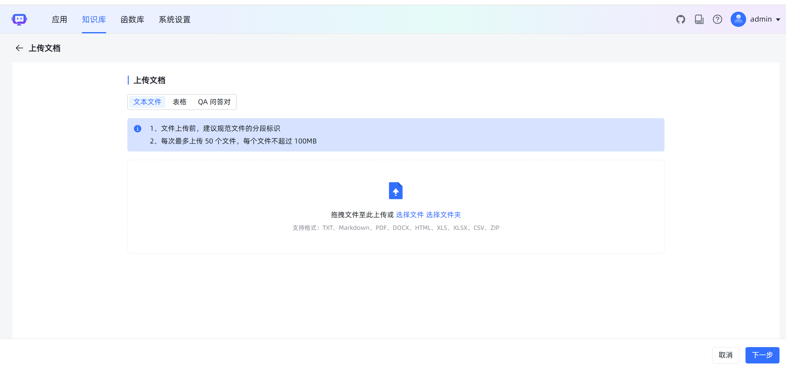
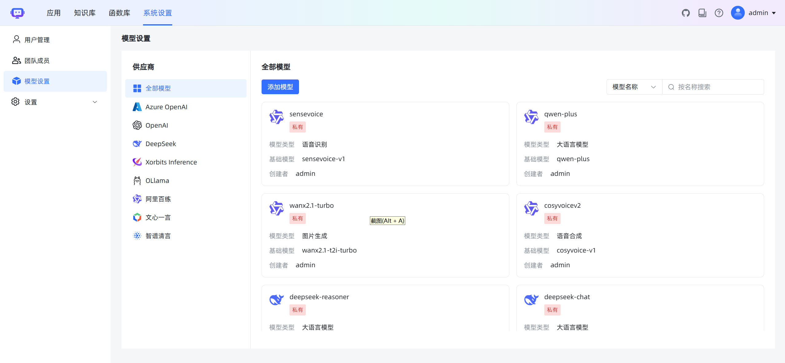

<h3 align="center">基于大模型和 RAG 的知识库问答系统</h3>
<h4 align="center">开箱即用、灵活的RAG知识库加工作流聊天机器人</h4>


MaxKB4j = Max Knowledge Base for Java，是一款基于Java语言开发的LLM工作流应用和 RAG 的开源LLMOps平台，项目主要借鉴了MaxKB和FastGPT,并将两个的优势结合到一个项目上，使用高性能、高稳定性以及安全可靠的JAVA语言重新设计开发。MaxKB4j广泛应用于 **智能客服、企业内部知识库、数据分析、学术研究与教育等场景** 。

- **开箱即用**：支持直接上传文档 / 自动爬取在线文档，支持文本自动拆分、向量化和 RAG（检索增强生成），有效减少大模型幻觉，智能问答交互体验好；
- **模型中立**：支持对接各种大模型，包括本地私有大模型（DeekSeek R1 / Llama 3 / Qwen 2 等）、国内公共大模型（通义千问 / 腾讯混元 / 字节豆包 / 百度千帆 / 智谱 AI / Kimi 等）和国外公共大模型（OpenAI / Claude / Gemini 等）；
- **灵活编排**：内置强大的工作流引擎和函数库，支持编排 AI 工作过程，满足复杂业务场景下的需求；
- **无缝嵌入**：支持零编码快速嵌入到第三方业务系统，让已有系统快速拥有智能问答能力，提高用户满意度。
- **支持接入MCP Server**：MCP（Model Context Protocol，模型上下文协议）是一个用于 AI 与开发环境交互的标准协议，让 AI 具备代码上下文的感知能力，而不只是单纯地做代码补全或聊天问答。
- **多种模型支持**：支持语音识别和语音合成模型、支持图像识别和图像生成模型。（视频生成模型支持规划中。。。）


## 快速开始

```
java -jar maxkb4j.jar
```

## Docker Compose 快速部署

```
docker-compose up -d
```
- 访问地址 - 访问地址 http://localhost:8080/login
- 默认用户/密码 admin/tarzan@123456


## UI 展示


<table style="border-collapse: collapse; border: 1px solid black;">
  <tr>
    <td style="padding: 5px;background-color:#fff;"></td>
    <td style="padding: 5px;background-color:#fff;"></td>
  </tr>
  <tr>
    <td style="padding: 5px;background-color:#fff;"></td>
    <td style="padding: 5px;background-color:#fff;"></td>
  </tr>
 <tr>
    <td style="padding: 5px;background-color:#fff;"></td>
    <td style="padding: 5px;background-color:#fff;"></td>
  </tr>
 <tr>
    <td style="padding: 5px;background-color:#fff;"></td>
    <td style="padding: 5px;background-color:#fff;"></td>
  </tr>
 <tr>
    <td style="padding: 5px;background-color:#fff;"></td>
    <td style="padding: 5px;background-color:#fff;"></td>
  </tr>
 <tr>
    <td style="padding: 5px;background-color:#fff;"></td>
    <td style="padding: 5px;background-color:#fff;"></td>
  </tr>
 <tr>
    <td style="padding: 5px;background-color:#fff;"></td>
    <td style="padding: 5px;background-color:#fff;"></td>
  </tr>
 <tr>
    <td style="padding: 5px;background-color:#fff;"></td>
    <td style="padding: 5px;background-color:#fff;"></td>
  </tr>
</table>

## 技术栈

- 前端：[Vue.js](https://cn.vuejs.org/)
- 后端：[Java17 / Springboot3](https://www.djangoproject.com/)
- 缓存：[caffeine](https://github.com/ben-manes/caffeine)
- LangChain4j：[LangChain4j](https://docs.langchain4j.dev/)
- 向量数据库：[PostgreSQL / pgvector](https://www.postgresql.org/)
- 全文检索数据库：[MongoDB](https://www.mongodb.com/)
- 用户鉴权：[sa-token](https://sa-token.dev33.cn/)

## 我的技术专栏

- [《看看这个！👉 点击AI大模型应用开发！🔥》](https://blog.csdn.net/weixin_40986713/category_12606825.html)

- **《AI语音合成与识别》**》：[https://blog.csdn.net/weixin_40986713/category_12735457.html](https://blog.csdn.net/weixin_40986713/category_12735457.html)

- **《AI绘画 | Stable diffusion》**：[https://blog.csdn.net/weixin_40986713/category_12481790.html](https://blog.csdn.net/weixin_40986713/category_12481790.html)

## 问题和建议

请提交 issues [https://gitee.com/taisan/MaxKB4j/issues](https://gitee.com/taisan/MaxKB4j/issues)

## 支持赞助
<table style="border-collapse: collapse; border: 1px solid black;">
  <tr>
    <th style="padding: 10px;"> <div align="center">支付宝赞赏码</div></th>
    <th style="padding: 10px;"> <div align="center">微信赞赏码</div></th>
  </tr>
  <tr>
    <td style="padding: 5px;background-color:#fff;"></td>
    <td style="padding: 5px;background-color:#fff;"></td>
  </tr>
</table>

- 赞助20元，可获得加作者微信号（vxhqqh）,加入微信交流群,(备注，已赞助，否则不通过)
- 赞助50元，可获得作者微信（vxhqqh）,加入微信交流群，并免费进入知识星球  https://wx.zsxq.com/group/28882525858841
- 赞助200元，可获取V1版本最新前端源码
- 赞助500元，可获取V2版本最新前端源码和后端源码

## License

Copyright (c) 2025-2035 洛阳泰山 TARZAN, All rights reserved.

根据GNU通用公共许可证版本3 (GPLv3)（“许可证”）进行许可；除非遵守许可，否则您不得使用此项目文件。您可以从以下网址获得许可证的副本

<https://www.gnu.org/licenses/gpl-3.0.html>

除非适用法律要求或经书面同意，依据本许可分发的软件均按“原样”提供，不附带任何形式的明示或暗示的担保或条件。有关许可下具体权限和限制的条款，请参见本许可协议。